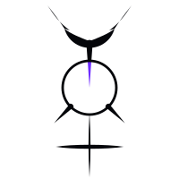
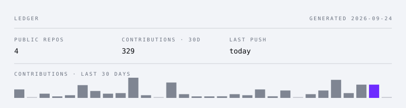

<picture>
  <source media="(prefers-color-scheme: dark)" srcset="assets/mercurius-dark.svg">
  
</picture>

SOLVE ET COAGULA

# morp1e

Learning to run these systems well enough that the judgement stays mine.

<a href="https://morpeia.com"><b>morpeia.com</b></a>
&nbsp;·&nbsp;
<a href="https://morpeia.com/links/">links</a>
&nbsp;·&nbsp;
<a href="mailto:me@morpeia.com">me@morpeia.com</a>

Digital Game Design student in Northern Cyprus, third year. I work on AI agent systems, digital art, and games.

---

Look at the artifact, not the aura.

Fluency is not quality.

A narrow claim beats a broad one.

When there is no evidence yet, silence is the answer.

---

## Work

|  |  |
|---|---|
| [**Limit**](https://github.com/morp1e/limit-tray) · [download](https://github.com/morp1e/limit-tray/releases/latest) | Claude Code and Codex CLI usage limits in the Windows tray, without keeping a session open. It estimates when the window fills from the samples it already has — and shows nothing when it does not have enough of them. |
| [**Mercurius 3D**](https://github.com/morp1e/mercurius-3d) · [live](https://morp1e.github.io/mercurius-3d/) | The mark raymarched as a liquid chrome body. One HTML file, WebGL2, no dependencies. Every shader constant traces back to a number in the master SVG. |
| [**Sıfırdan**](https://github.com/morp1e/sifirdan) | A Turkish series for people starting with AI from zero — notes, a glossary, a page per episode. |
| [**morpeia.com**](https://morpeia.com) | The site. Hand-written, no framework, no tracker, and not one third-party request: even the typefaces are served from its own origin. |
| [**fable-orchestration-pro**](https://github.com/morp1e/fable-orchestration-pro) | Avenox's model-routing policy, adapted from the Max tier to what a $20 Claude Pro plan can actually afford. |

The full list is <a href="https://github.com/morp1e?tab=repositories">here</a>, mirrors and unfinished things included. Nothing is kept out of sight to make this section look better.

---

## Ledger

<picture>
  <source media="(prefers-color-scheme: dark)" srcset="assets/ledger-dark.svg">
  
</picture>

Regenerated daily by <a href="./.github/workflows/ledger.yml">a workflow in this repo</a> — no third-party service renders it. Forks are not counted.
